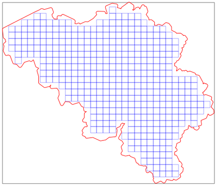
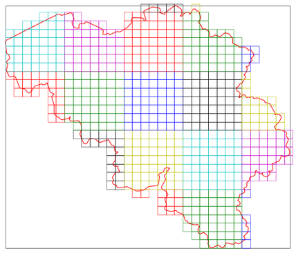

pygridmap
=========

Geoprocessing tools for efficient geometric mapping and set operations over regular grids.
---

The `pygridmap` package enable you to perform some basic geometric/set operations over vector datasets, including regular grid maker (_i.e._, rasterisation) and grid overlay (_i.e._ intersection and union). The code takes advantage of multiprocessor capabilities for efficient tile-based processing. 

**Description**

The package `pygridmap` supports the following methods/algorithms: 
* basic [**geometric/set operations and geoprocessing**] over geospatial grid (_e.g._, bounding box manipulations, locations definition, _etc_...) with the [`GridProcessor`](pygridmap/base.py) class,
<!-- -->
<table align="center"> <tr> <td align="center" width="750px"> </img></td></tr> </table>

* user-defined [**rasterisation**](https://en.wikipedia.org/wiki/Rasterisation) of polygon regions (_e.g._, vector boundaries) into regular grids of various resolutions (_i.e._, dimension of one-size square grid cells) with the [`GridMaker`](pygridmap/gridding.py) class (see also `Java` implementation [GridMaker](https://github.com/eurostat/GridMaker)),
<!-- -->
<table align="center"><tr> 
        <td align="center" width="300px"> </img></td>
        <td align="center" width="300px"> </img></td>
</tr> </table>

* customised [**vector overlay operations**](https://docs.qgis.org/3.10/en/docs/user_manual/processing_algs/qgis/vectoroverlay.html) (_e.g._, intersection, union, overlay/overlap and merging) between any polygon layer and a geospatial grid ("regular" or not) with the [`Gridoverlay`](pygridmap/overlay.py) class.
<!-- -->
<table align="center"> <tr> <td align="center" width="300px"> </img></td></tr> </table>

**Quick install and start**

**Usage**

*In your `Python` script*

*Through the `bash` command*

**Note**

The implementation of the methods above adopts (customised, using the [`multiprocessing`](https://docs.python.org/3/library/multiprocessing.html) module) multitprocessor tiling processing together with (native) vector processing whenever possible in order to take advantage of multiprocessor compute capabilities. Note  that the [`FrameProcessor`](pygridmap/base.py) class can be used to run embarassing parallel calculations on dataframe rows.
<!-- -->
<table align="center"> <tr> <td align="center" width="300px"> </img></td> </tr> </table>

Geometric operations are making an extensive use of the geometric/geospatial `Python` module [`geopandas`](https://geopandas.org/) since this module supports essential features (most of them derived from the [`shapely`](https://shapely.readthedocs.io/en/latest/manual.html) [`fiona`](https://fiona.readthedocs.io/en/latest/manual.html) libraries), like:
  * basic [set](https://geopandas.org/set_operations.html) and [geometric](https://geopandas.org/geometric_manipulations.html) operations, and
  * [spatial indexing](https://geopandas.org/mergingdata.html?highlight=spatial%20index) through the [R-Tree algorithm](https://automating-gis-processes.github.io/site/notebooks/L3/spatial_index.html).
  
These implementations are probably not optimal since they are wrappers to the [`GEOS`](https://trac.osgeo.org/geos/) library, itself a port of the Java Topology Suite ([`JTS`](https://projects.eclipse.org/projects/locationtech.jts)), similarly to what is used in QGis.

They also 

**About**

<table align="center">
    <tr> <td align="left"><i>documentation</i></td> <td align="left"><b>in construction</b></td>  </tr> 
    <tr> <td align="left"><i>status</i></td> <td align="left">since 2020 &ndash; <b>ongoing</b></td></tr> 
    <tr> <td align="left"><i>contributors</i></td> 
    <td align="left" valign="middle">

</td> </tr> 
    <tr> <td align="left"><i>license</i></td> <td align="left"><a href="https://joinup.ec.europa.eu/sites/default/files/eupl1.1.-licence-en_0.pdfEUPL">EUPL</a> </td> </tr> 
</table>

**Resources**

* Data handling: [`numpy`](https://numpy.org/) and [`pandas`](http://pandas.pydata.org).
* Geospatial data processing: [`geopandas`](http://geopandas.org), [`fiona`](https://fiona.readthedocs.io/en/latest/manual.html), [shapely](https://pypi.org/project/Shapely/), [`RTree`](https://toblerity.org/rtree/), [`geopy`](https://github.com/geopy/geopy) and [`pyproj`](https://github.com/pyproj4/pyproj).
* Map visualisations: [`ipyleaflet`](https://github.com/jupyter-widgets/ipyleaflet) or [`folium`](https://github.com/python-visualization/folium).
* See also projects [python-geospatial](https://github.com/giswqs/python-geospatial), a collection of `Python` packages for geospatial analysis, and earthdatascience, a repository of `Python` [tutorials](https://www.earthdatascience.org/tutorials/python/) and [workshop](https://www.earthdatascience.org/workshops/gis-open-source-python/).

**References**

* Lovelace R., Nowosad J. and Muenchow J. (2019): [**Geocomputation with R**](https://geocompr.robinlovelace.net/), _Chapman & Hall/CRC_.
* de Smith M.J., Goodchild M.F. and Longley P.A. (2018): [**Geospatial Analysis: A Comprehensive Guide to Principles, Techniques and Software Tools**](https://www.spatialanalysisonline.com/HTML/index.html), _The Winchelsea Press_. 
* Garrard C. (2016): **Geoprocessing with Python**, _Manning Publications_.
* Westra E. (2016): [**Python Geospatial Development**](https://www.programmer-books.com/wp-content/uploads/2019/04/Python-Geospatial-Development-3rd-Edition.pdf), _PACKT Publishing_.
* Bahgat K. (2016): **Python Geospatial Development Essentials**, _PACKT Publishing_.
* Lawed J. (2015): [**QGIS Python Programming CookBook**](https://www.programmer-books.com/wp-content/uploads/2019/05/QGIS-Python-Programming-Cookbook.pdf), _PACKT Publishing_.
* Kresse W. and Danko D.M., eds. (2012): **Handbook of Geographic Information**, _Springer_, doi: [10.1007/978-3-540-72680-7](https://doi.org/10.1007/978-3-540-72680-7).
